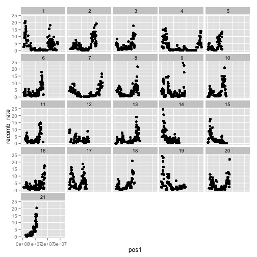
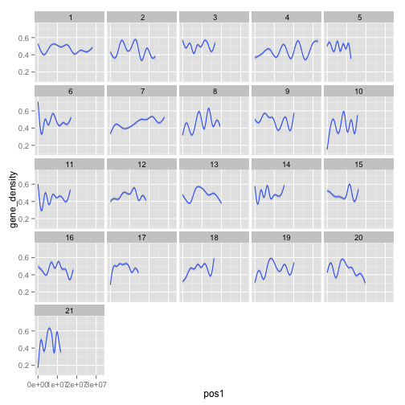
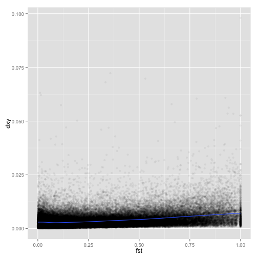
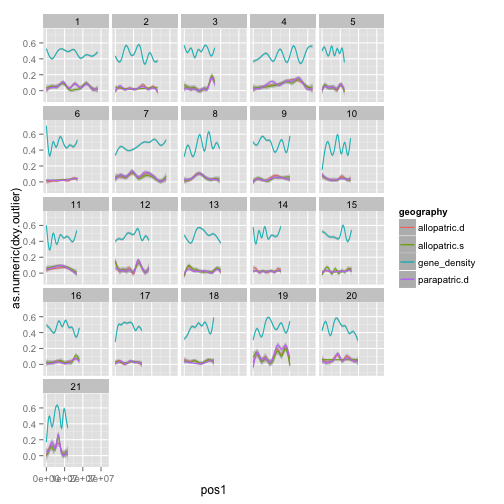
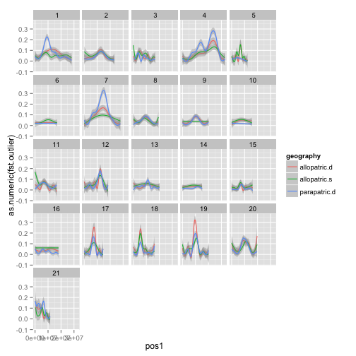

# Genome Meta Analysis - Results Preview (75k windows)
This is a preview of the analysis code and results from our meta-analysis.

# 1. Libraries

```r
rm(list=ls())

library("dplyr")
library("reshape2")
library("ggplot2")
library("hexbin")
library("nlme")
library("lme4")
library("car")
library("visreg")
```

# 2. Read in raw data


```r
all.data <- read.table(file=file.path("analysis_ready","stats_75k_2015-05-08.txt"), 
                       header=TRUE, 
                       na.strings=c("NA", "<NA>"))
```

# 3. FST / Dxy pre-processing

## FST / Dxt outlier detection (placeholder until Diana's version complete)

```r
# set negative FSTs to NA
all.data[!is.na(all.data$fst) & all.data$fst<0, ]$fst <- NA

# basic outlier detection with dplyr
is.outlier <- function(x){
  return(x > quantile(x, na.rm=TRUE, probs=0.95)[1])
}

all.data.filt <- all.data %>%
  group_by(comparison) %>%
  mutate(fst.outlier = is.outlier(fst)) %>%
  mutate(dxy.outlier = is.outlier(dxy)) %>%
  mutate(both.outlier = dxy.outlier == TRUE & fst.outlier == TRUE)

outlier.dat <- data.frame(ungroup(all.data.filt))
```

# 4. Filtration of genomic variables


```r
# Recombination distances >25cM
outlier.dat$recomb_rate[outlier.dat$recomb_rate >= 25] <- NA

# Gene true/false
outlier.dat$in.a.gene <- as.numeric(!is.na(outlier.dat$gene_id))

# KS
outlier.dat$ks[outlier.dat$ks >= 1] <- NA

# dS
outlier.dat$ds[outlier.dat$ds >= 1] <- NA

# gene_count
outlier.dat$gene_count[outlier.dat$gene_count >= 20] <- NA

# marine pi
#outlier.dat$gene_count[outlier.dat$pi_pac_10k>=0.02]<-NA
```

# 5. Visualizations of genomic variables

## Recombination rate

```r
outlier.dat %>%
  filter(!is.na(recomb_rate)) %>%
  ggplot(aes(x=pos1,y=recomb_rate))+
    geom_point()+
    facet_wrap(~lg)
```

 

## fst vs. dxy

```r
ggplot(data=outlier.dat,aes(x=fst,y=dxy))+
  geom_point(alpha=0.05)+
  geom_smooth()+
  scale_alpha(range = c(0.001, 1))
```

 

## dxy outliers 

```r
outlier.dat %>%
  ggplot(aes(x=pos1, y=as.numeric(dxy.outlier), color=geography))+
    geom_smooth()+
    facet_wrap(~lg)
```

 

## fst outliers 

```r
outlier.dat %>%
  ggplot(aes(x=pos1, y=as.numeric(fst.outlier), color=geography))+
    geom_smooth()+
    facet_wrap(~lg)
```

 

## dxy & fst outliers 

```r
outlier.dat %>%
  ggplot(aes(x=pos1, y=as.numeric(both.outlier), color=geography))+
    geom_smooth()+
    facet_wrap(~lg)
```

 

# 6. Divergence metrics vs. genomic variables


```r
outlier.dat%>%
  filter(lg!=19,!is.na(dxy))%>%
  filter(grepl("allo",study)) %>% 
  filter(grepl("con",comparison)) %>%
  mutate(study_com=paste(study,comparison,sep="_"))%>%
    ggplot(.,aes(x=pos1,y=as.numeric(dxy.outlier),color="dxy"))+
    geom_smooth()+
    geom_smooth(aes(x=pos1,y=as.numeric(fst.outlier),color="fst"))+
    facet_grid(study_com~lg)

outlier.dat%>%
  filter(lg!=19,!is.na(dxy))%>%
  #filter(grepl("allo",study)) %>% 
  filter(grepl("boo",comparison)) %>%
  mutate(study_com=paste(study,comparison,sep="_"))%>%
  ggplot(.,aes(x=pos1,y=dxy,color="dxy"))+
  geom_smooth()+
  geom_smooth(aes(x=pos1,y=fst/50,color="fst"))+
  geom_smooth(aes(x=pos1,y=recomb_rate/500,color="recomb"))+
  facet_grid(study_com~lg)

outlier.dat%>%
  filter(lg!=19)%>%
  mutate(allopatric=as.factor((study=="allopatric")))%>%
  ggplot(.,aes(x=fst,y=dxy,color=allopatric))+
    #geom_point()+
    #scale_y_continuous(limits=c(0, 0.05))+
    geom_smooth(method="lm")


outlier.dat%>%
  filter(lg!=19,!is.na(dxy))%>%
  mutate(study_com=paste(study,comparison,sep="_"))%>%
  ggplot(.,aes(x=pos1,y=log(fst+1)/dxy))+
  geom_smooth()+
  facet_grid(study_com~lg)

outlier.dat%>%
  filter(lg!=19)%>%
  mutate(study_com=paste(study,comparison,sep="_"))%>%
  ggplot(.,aes(x=pos1,y=dxy,color=study_com))+geom_smooth()+facet_wrap(~lg)

ggplot(data=outlier.dat,aes(x=pos1,y=dxy,color=dxy.outlier))+geom_point()+facet_wrap(~lg)

ggplot(data=outlier.dat,aes(x=recomb_rate,y=as.numeric(dxy.outlier)))+
  geom_point()+
  stat_smooth( aes(y = as.numeric(dxy.outlier)),  method="glm", family="binomial", se=F) 

outlier.dat%>%
  filter(lg!=19,!is.na(both.outlier))%>%
ggplot(.,aes(y=recomb_rate,x=as.factor(both.outlier)))+
  geom_boxplot()

outlier.dat%>%
  filter(lg!=19,!is.na(both.outlier))%>%
  ggplot(.,aes(y=recomb_rate,x=as.factor(geography)))+
  geom_boxplot()

outlier.dat%>%
  filter(lg!=19,!is.na(both.outlier))%>%
  mutate(study_com=paste(study,comparison,sep="_"))%>%
  ggplot(.,aes(x=pos1,y=as.numeric(both.outlier)))+
  geom_smooth()+
  facet_grid(study_com~lg)
  
  

ggplot(data=all.data.out,aes(y=ds,x=as.factor(outlier)))+geom_boxplot()

ggplot(data=all.data.out,aes(x=recomb_rates))+geom_histogram()+facet_wrap(~in.a.gene)

ggplot(data=all.data.out,aes(x=as.factor(in.a.gene),y=recomb_rates))+geom_boxplot()

summary(lm(log(pi_pac_marine+1)~in.a.gene,data=all.data.out))


####LINEAR MODELS

mod1<-outlier.dat%>%
  filter(lg!=19)%>%
  mutate(gene.flow=!grepl("allopatric",study))%>%
  mutate(div.selection=!grepl("allopatric.s",study))%>%
  with(.,glm(dxy.outlier~recomb_rate*
               gene.flow*
               div.selection,
               na.action="na.omit",
               family=binomial))

summary(mod1)
visreg(mod1,"recomb_rate",by="div.selection")
Anova(mod1)
Anova(mod1,type="I")
anova(mod1)

mod1<-outlier.dat%>%
  filter(lg!=19)%>%
  #filter(study!="fer",study!="hohenlohe")%>%
  with(.,glm(fst.outlier~recomb_rate*geography,na.action="na.omit",family=quasibinomial))

outlier.dat%>%
  filter(lg!=19)%>%
  ggplot(aes(x=recomb_rate,y=as.numeric(fst.outlier),colour=geography))+
    geom_point(alpha=0.1)+
    geom_smooth()+
    coord_cartesian(xlim=c(0,5),ylim=c(0,0.25))

outlier.dat%>%
  filter(lg!=19)%>%
  ggplot(aes(x=recomb_rate,y=as.numeric(both.outlier),colour=geography))+
  geom_point(alpha=0.1)+
  geom_smooth()+
  coord_cartesian(xlim=c(0,2),ylim=c(0,0.1))
    
    

visreg(mod1,"geography")
visreg2d(mod1,x="recomb_rate",y="pi_pac_75k",plot.type="image",trans=exp)
visreg2d(mod1,"recomb_rate","ds")

#type 1 ANOVA
Anova(mod1)
Anova(mod1,type=2)

mod1<-glm(dxy~recomb_rate,data=outlier.dat,na.action="na.omit")
anova(mod1)
mod2<-glmer(outlier~pi_pac_marine+recomb_rates+(1|study),data=all.data.out,na.action="na.omit",family=binomial)

mod1<-lme(log(fst+1)~in.a.gene,random=~1|pop,data=all.data.out,na.action="na.omit")


ggplot(data=all.data,aes(x=pos,y=fst,color=pop))+geom_smooth()+facet_wrap(~lg)
ggplot(data=all.data.filt,aes(y=log(pi_pac_marine),x=outlier))+geom_boxplot()

#summary(with(outlier.dat,glm(dxy.outlier~ds+recomb_rate+phastcons+gene_count+gene_density+pi_pac_10k,family="binomial")))

#outlier.dat%>%
#  filter(!is.na(fst),!is.na(dxy))%>%
#with(.,cor.test(as.numeric(fst.outlier),as.numeric(dxy.outlier),method="pearson"))
```


